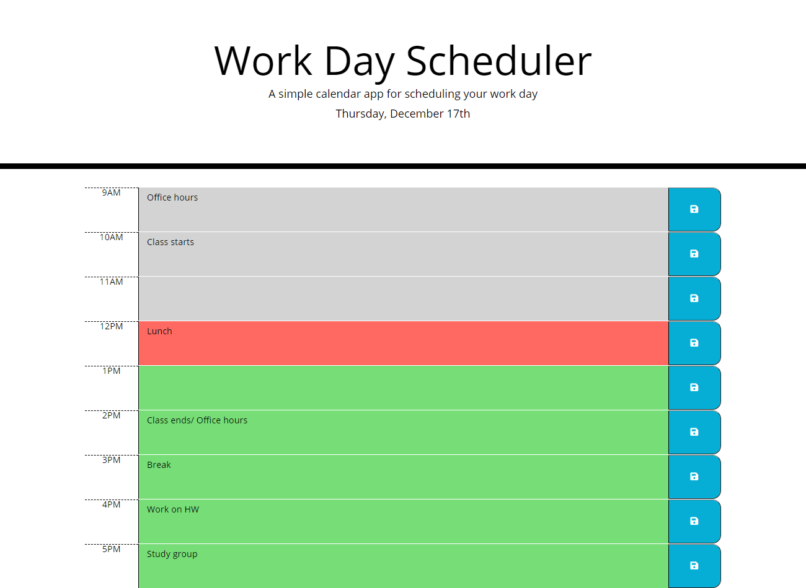

# workday-planner
A simple workday application using HTML, CSS and jQuery

## Description

This application is a single-day fixed-interval day planning tool.  The code was written using HTML, CSS, Bootstrap CSS framework, JavaScript, jQuery libraries, and font-awesome icon toolkit.  The application can be used to record and save tasks to be performed over a standard 9am-5pm workday.

### Features
* Current day displayed in application header
* Discrete time block elements for each hour of the working day
* Editable textareas within each time block to record tasks for the specified time period
* Clickable save buttons which will save the text input by the user to localStorage, allowing it to persist across page refreshes
* Color-coding of time blocks relative to the current hour (past, present and future)

## Installation
Upload index.html, license.txt, and assets folder to the deployed webserver.  Assets folder contains JavaScript and CSS files.

The application shown below was deployed using GitHub Pages.  The repository can be replicated by via fork, clone, and redeployment with GitHub Pages.

Link to repository: https://github.com/pkriengsiri/workday-planner 

## Usage
Link to deployed instance of the application: 

## Credits
Collaborators on this project included instructional staff, TAs, and students in the Georgia Tech Coding Boot Camp Winter 2020 cohort.

### Referenced Utilized
* https://api.jquery.com/hover/

## License

MIT License

Copyright (c) [2020] [Pete Kriengsiri]

Permission is hereby granted, free of charge, to any person obtaining a copy
of this software and associated documentation files (the "Software"), to deal
in the Software without restriction, including without limitation the rights
to use, copy, modify, merge, publish, distribute, sublicense, and/or sell
copies of the Software, and to permit persons to whom the Software is
furnished to do so, subject to the following conditions:

The above copyright notice and this permission notice shall be included in all
copies or substantial portions of the Software.

THE SOFTWARE IS PROVIDED "AS IS", WITHOUT WARRANTY OF ANY KIND, EXPRESS OR
IMPLIED, INCLUDING BUT NOT LIMITED TO THE WARRANTIES OF MERCHANTABILITY,
FITNESS FOR A PARTICULAR PURPOSE AND NONINFRINGEMENT. IN NO EVENT SHALL THE
AUTHORS OR COPYRIGHT HOLDERS BE LIABLE FOR ANY CLAIM, DAMAGES OR OTHER
LIABILITY, WHETHER IN AN ACTION OF CONTRACT, TORT OR OTHERWISE, ARISING FROM,
OUT OF OR IN CONNECTION WITH THE SOFTWARE OR THE USE OR OTHER DEALINGS IN THE
SOFTWARE.

## Badges

## Contributing

This project is not accepting contributions at this time.